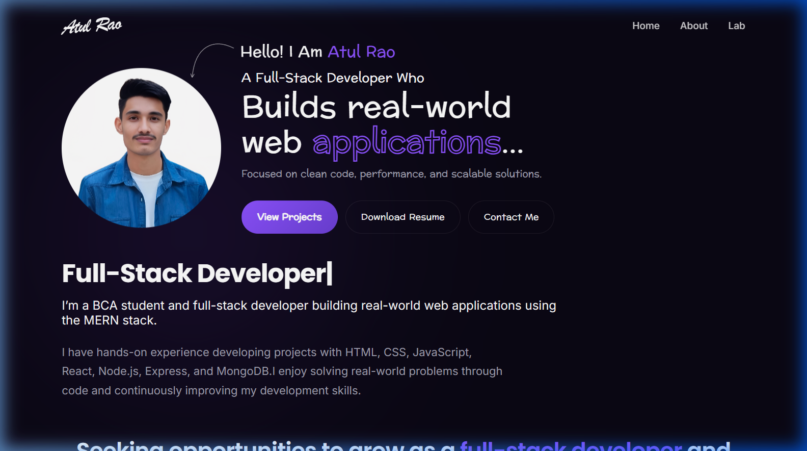
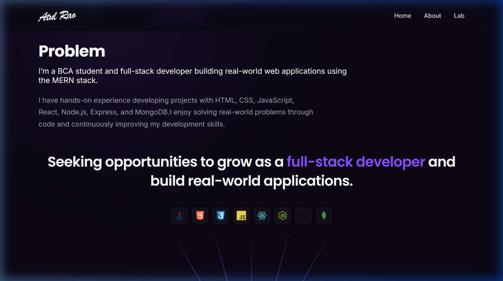
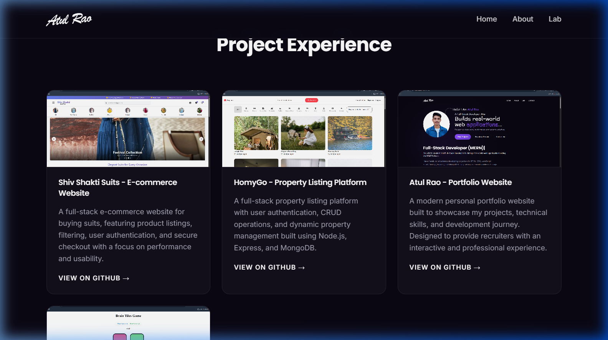
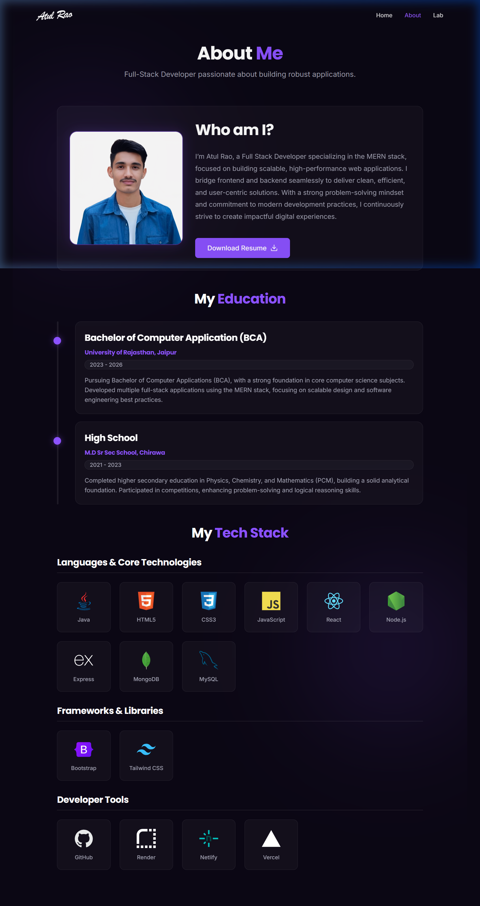
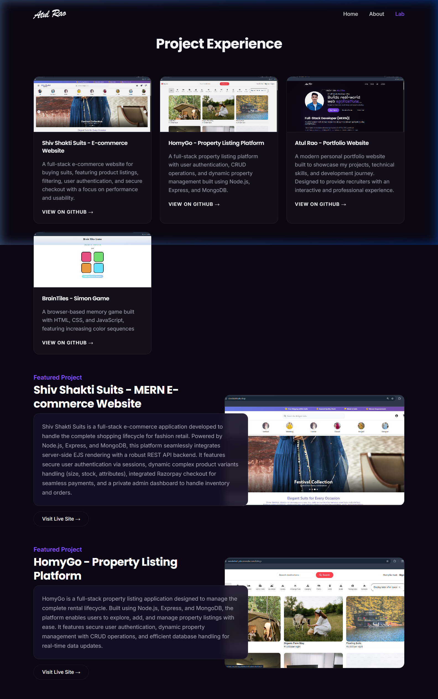

# 🌌 Atul Rao — MERN Stack Developer Portfolio

<p align="center">
  
  
  
  
  
</p>

A premium, recruiter-centric, and highly interactive **Full-Stack Developer Portfolio** designed and developed by **Atul Rao**. This application serves as a showcase of my academic background (Bachelor of Computer Applications - BCA), hands-on development expertise, and catalog of full-stack web products. 

Featuring a stunning, responsive **Glassmorphic UI** built entirely from scratch with **Vanilla CSS** and powered by a secure **MERN Backend** that captures recruiter inquiries directly into a MongoDB database.

---

## 🔗 Quick Navigation & Live Links
* 🧑‍💻 **Developer Name:** Atul Rao (BCA Student, University of Rajasthan)
* 📬 **Direct Email:** [02atulrao@gmail.com](mailto:02atulrao@gmail.com)
* 💼 **LinkedIn Profile:** [Atul Rao on LinkedIn](https://www.linkedin.com/in/atul-rao-44b2212b8/)
---
## 🌟 Key Application Features

### 🎨 Frontend Experience
* **Glassmorphic UI Design:** High-fidelity visuals utilizing blur filters, subtle gradients, Tailwind-style layouts, and custom-tailored HSL neon-glow elements.
* **Responsive Layout:** 100% responsive across mobile, tablet, and widescreen monitors with custom CSS media queries.
* **Fluid Typing Interactions:** Elegant typewriter transitions via `react-type-animation` showcasing core specialties on the landing page.
* **Interactive Navigation:** Smooth SPA client-side routing implemented using `react-router-dom` with active tab styling and section scroll anchors.
* **Animated Tech Stack Grid:** Custom icons highlighting languages, framework packages, and deployment ecosystems with interactive hover scaling.

### ⚙️ Backend & Database Security
* **RESTful API Architecture:** Express-powered API endpoint handling form submissions.
* **MongoDB Data Persistence:** Direct Mongoose integration with strict validation schemas.
* **Secure Database Configuration:** Sanitized input processing and environment-driven port/URI handling using `dotenv` and `cors`.
* **Deployment Ready:** Configured to instantly bridge local endpoints with environment variables for seamless deployment on Render, Netlify, and Vercel.

---

## 📸 Desktop Interface Showcase

Below are actual, high-resolution screenshots highlighting the visual style and features of the portfolio website.

| Page / Section | Description & Visual Keynotes | Live Interface Preview |
| --- | --- | --- |
| **Hero Landing** | *Featuring fluid typewriter animations ("Full-Stack Developer (MERN)", "Problem Solver"), a customizable avatar card, and primary CTA buttons.* |  |
| **About Section (Home)** | *A glassmorphic summary giving visitors a quick, elegant glance at my background and development passion.* |  |
| **Projects Grid (Home)** | *Direct-link portfolio cards showcasing recent web application creations with GitHub source links.* |  |
| **Dedicated About Page** | *A deep dive showing my BCA education timeline (2023–2026), downloadable PDF resume, and an organized, responsive tech stack grid.* |  |
| **Dedicated Lab Page** | *A catalog detailing my key projects with descriptive previews, tech summaries, and live deployment links.* |  |

---

## 🛠️ Complete Tech Stack Overview

### 💻 Frontend
<p align="left">
  
  
  
  
  
  
</p>

### ⚙️ Backend & Databases
<p align="left">
  
  
  
  

</p>

### ☁️ Infrastructure & Utilities
<p align="left">
  
  
  
  
</p>

---

## 📂 Project Architecture

```txt
Portfolio/
├── backend/                  # MERN API server
│   ├── models/
│   │   └── Contact.js        # Mongoose schema for contact messages
│   ├── routes/
│   │   └── contactRoutes.js  # API route endpoints
│   ├── .env                  # Port & Database Secrets (excluded from git)
│   ├── server.js             # Server startup file
│   └── package.json
│
├── frontend/                 # Client React SPA
│   ├── public/               # Static assets & projects
│   ├── src/
│   │   ├── assets/           # Portfolio media files (Resume, Images)
│   │   ├── components/       # Reusable layout sections (Hero, About, Lab, Contact)
│   │   ├── pages/            # Multi-page layouts (HomePage, AboutPage, LabPage)
│   │   ├── App.jsx           # Main routing assembly
│   │   ├── index.css         # Global design system & theme variables
│   │   └── main.jsx
│   ├── vite.config.js
│   └── package.json
│
├── screenshots/              # High-definition interface screenshots
└── package.json              # Shared project utilities
```


## 🚀 Step-by-Step Local Setup

Follow these simple instructions to download, configure, and launch this MERN portfolio website locally.

### 1️⃣ Clone the Repository
```bash
git clone https://github.com/AtulRao22/Portfolio.git
cd Portfolio
```

### 2️⃣ Configure Backend Environment
Navigate into the `backend` folder and create a `.env` file to securely define your credentials:
```bash
cd backend
npm install
```
Create a `.env` file with the following variables:
```env
PORT=5000
MONGO_URI=your_mongodb_connection_string
```
Start the backend development server:
```bash
node server.js
# Or if you have nodemon globally:
# npm run dev / nodemon server.js
```

### 3️⃣ Configure Frontend Environment
In a new terminal window, navigate to the `frontend` folder and launch the Vite development server:
```bash
cd frontend
npm install
npm run dev
```
By default, the Vite application starts on `http://localhost:5173`. Make sure the frontend utilizes the local backend:
---

## 🌟 Spotlight Projects Catalog

The portfolio showcases key web products developed by Atul Rao:

1. **🛍️ Shiv Shakti Suits (MERN E-Commerce Website):**
   * A high-performance commercial storefront built for fashion retail.
   * *Key features:* Private Admin portal with Inventory controls, payment integration (Razorpay), secure user sessions, and clean product variant catalog management.
   * *Live:* [shivshaktisuits.shop](https://www.shivshaktisuits.shop/)

2. **🏠 HomyGo (Property Listing Platform):**
   * A full-stack real estate listing and property rental management system.
   * *Key features:* Full CRUD implementations for landlords/agents, dynamic reviews integration, session authentication, and MongoDB storage.
   * *Live:* [HomyGo](https://wanderlust-ynlv.onrender.com)

3. **🎮 BrainTiles (Simon Memory Game):**
   * A retro color-pattern matching cognitive browser game built using native HTML5, JavaScript, and elegant CSS transitions.
   * *Live:* [BrainTiles](https://braintiles.netlify.app)

---

<p align="center">
  <b>Developed with ❤️ by <a href="https://github.com/AtulRao22">Atul Rao</a> © 2026</b>
</p>
